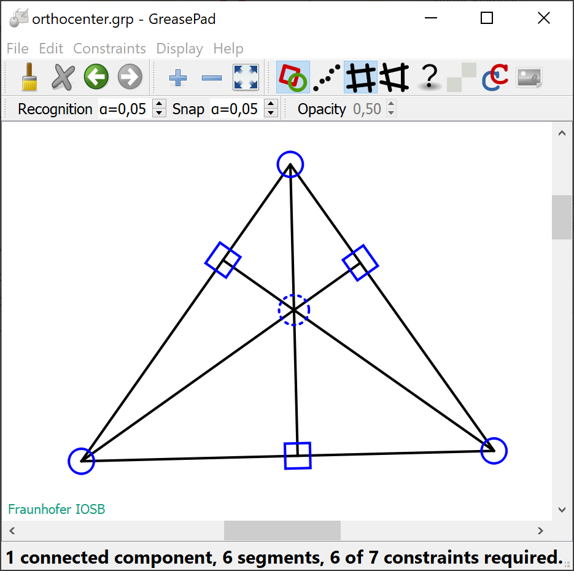
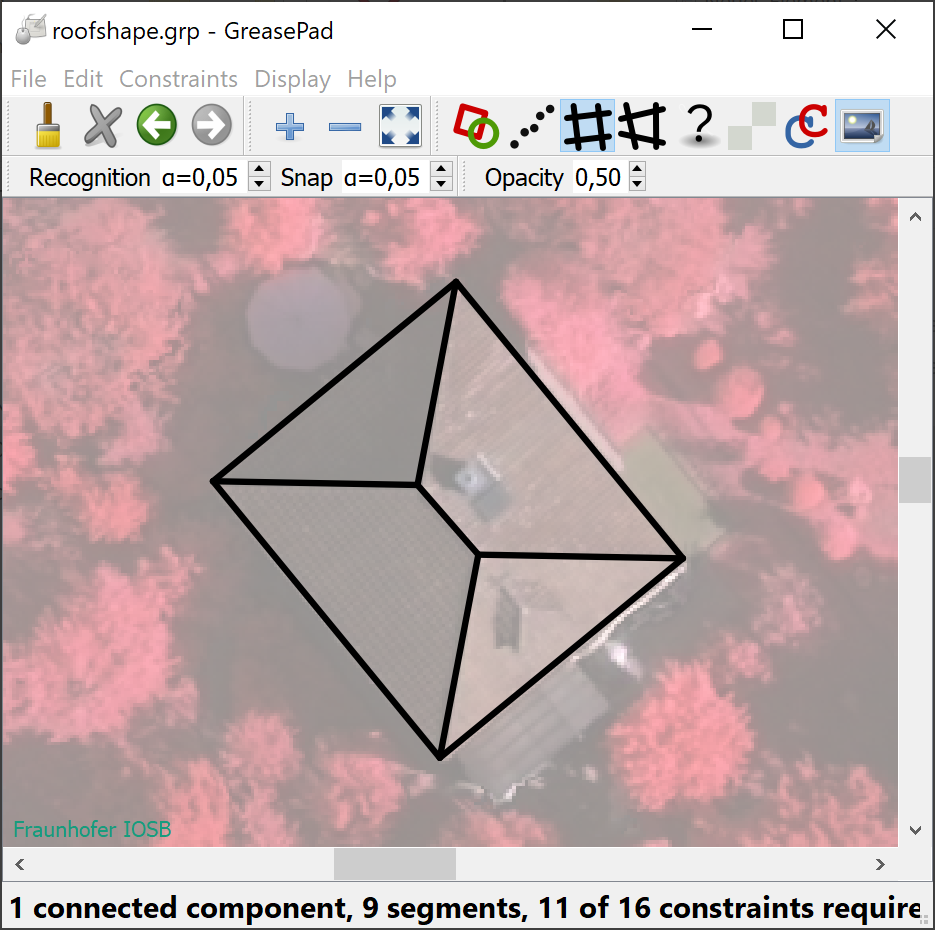

# GreasePad
**Freehand Drawing guided by Geometric REASoning**

The *GreasePad* provides a drawing area and expects pen strokes as the only user input. These strokes are approximated by straight line segments leading to line drawings. During this interactive process, geometric relations such as orthogonallity are recognized and automatically enforced by an adjustment procedure. The program can be utilzed to analyse systems of straight lines and constraints (theorem proving) or to outline the shapes of human-made objects in images. As a pointing device, you can use a computer mouse, a stylus, or one of your fingers in combination with a touchscreen.

### Screenshots

### Copyright

Copyright (c) 2022 Jochen Meidow, [Fraunhofer IOSB](http::/www.iosb.fraunhofer.de), Germany.

### Licensing

This program is free software: you can redistribute it and/or modify it under the terms of the GNU General Public License as published by the Free Software Foundation, either [version 3 of the License](https://www.gnu.org/licenses/gpl-3.0.en.html), or (at your option) any later version.

This program is distributed in the hope that it will be useful, but WITHOUT ANY WARRANTY; without even the implied warranty of MERCHANTABILITY or FITNESS FOR A PARTICULAR PURPOSE.  See the GNU General Public License for more details.

You should have received a copy of the GNU General Public License along with this program.  If not, see <https://www.gnu.org/licenses/>.
	
### Requirements

For the compiliation and building of the programme, the following components are required:

- The **C++ template library [Eigen](https://eigen.tuxfamily.org)**, version 3.4.0, for linear algebra, i.e, matrices, vectors, numerical solvers, and related algorithms.
- The **widget toolkit [Qt](https://www.qt.io)**, version 5.11.0, for creating the graphical user interface.
      
	  
### Building from source

- Get the Qt toolkit and the Eigen library.
- Clone the source code, i.e.,
`git clone www.github.com/FraunhoferIOSB/GreasePad.git`
- Building the programme, e.g., using the integrated development environment *QtCreator* or using *CMake* with the file *CMakeLists.txt*.

### Contributing to GreasePad

The software is still under development. Contributions in form of issues and pull requests are highly welcome.

  
### References

Details on the utilized methods can be found in the following papers:

- J. Meidow and L. Lucks (2019) [Draw and Order - Modeless Interactive Acquisition of Outlines](https://doi.org/10.5194/isprs-annals-IV-2-W7-103-2019). ISPRS - Annals of Photogrammetry, Remote Sensing and Spatial Information Sciences, vol. IV-2/W7, pp. 103-110
- J. Meidow, H. Hammer, and L. Lucks (2020) [Delineation and Construction of 2D Geometries by Freehand Drawing and Geometric Reasoning](https://www.isprs-ann-photogramm-remote-sens-spatial-inf-sci.net/V-5-2020/77/2020/). ISPRS - Annals of the Photogrammetry, Remote Sensing and Spatial Information Sciences, vol. V-5-2020, pp. 77-84
    
	
Please cite these papers when using *GreasePad* or parts of it in an academic publication.

### Contact

Jochen Meidow, Fraunhofer IOSB, Ettlingen, Germany.

jochen.meidow@iosb.fraunhofer.de
