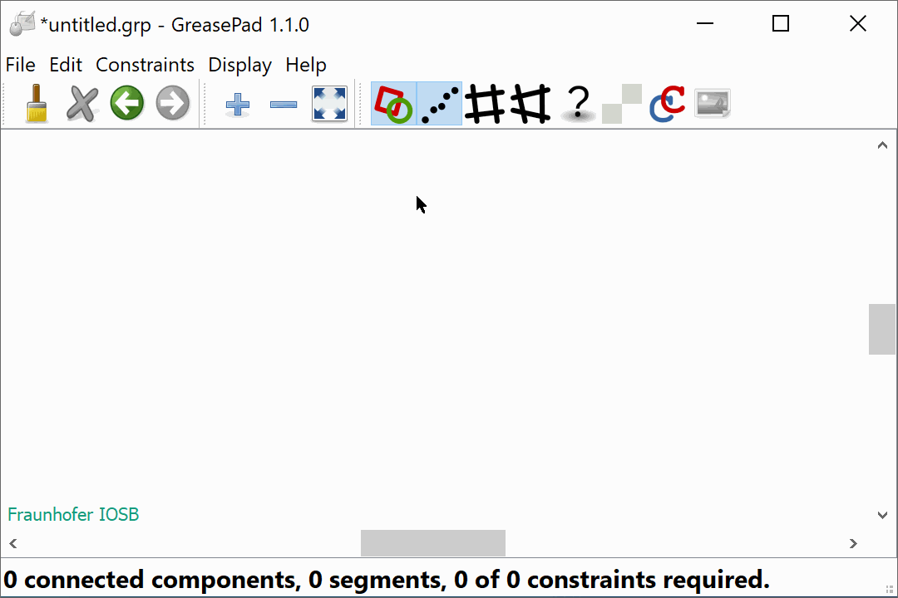
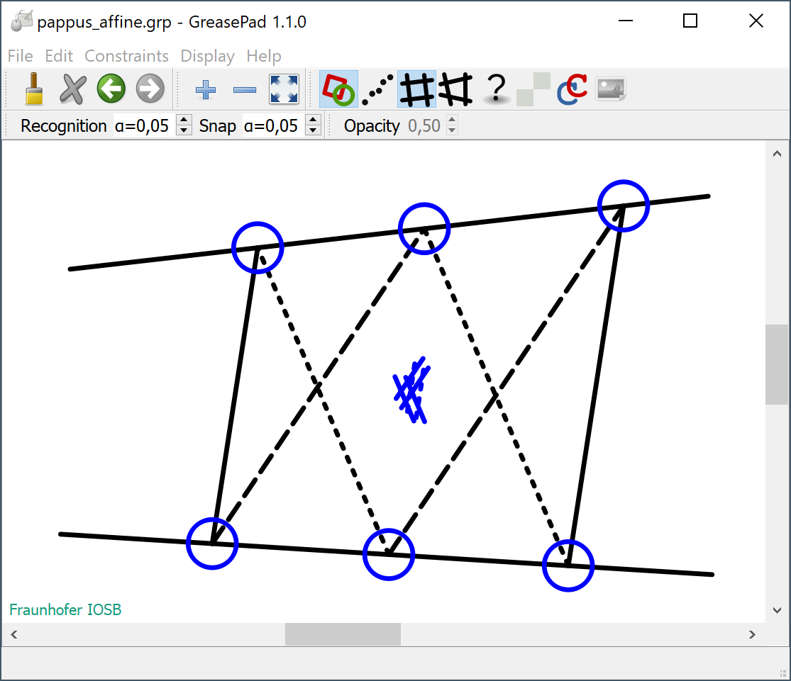
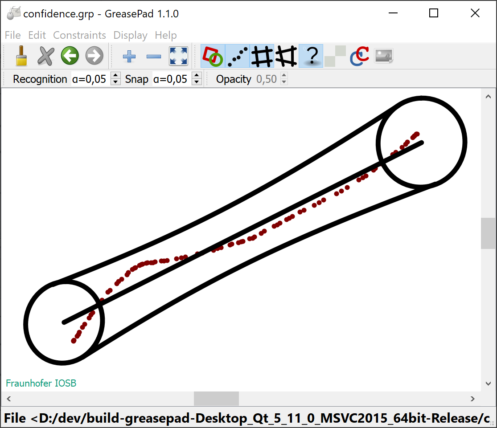
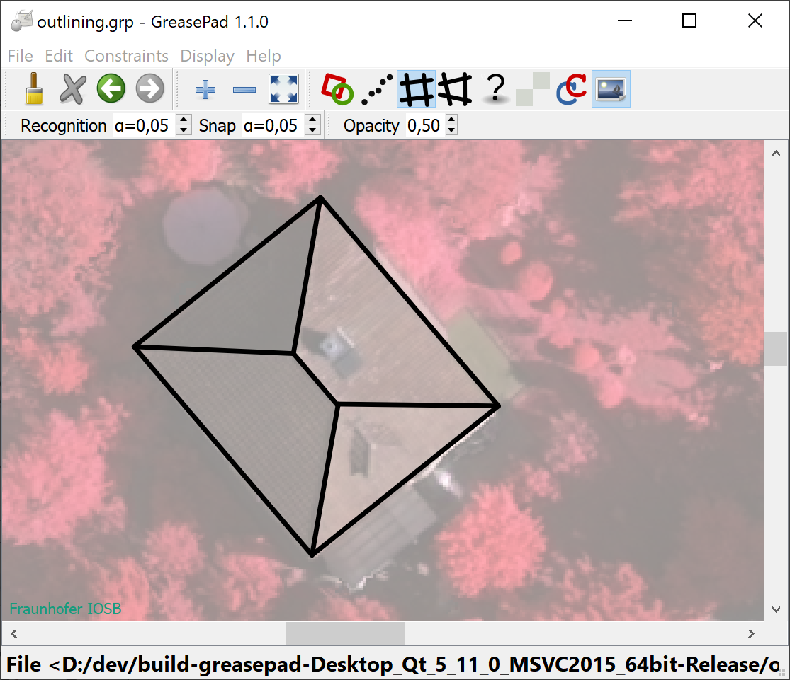
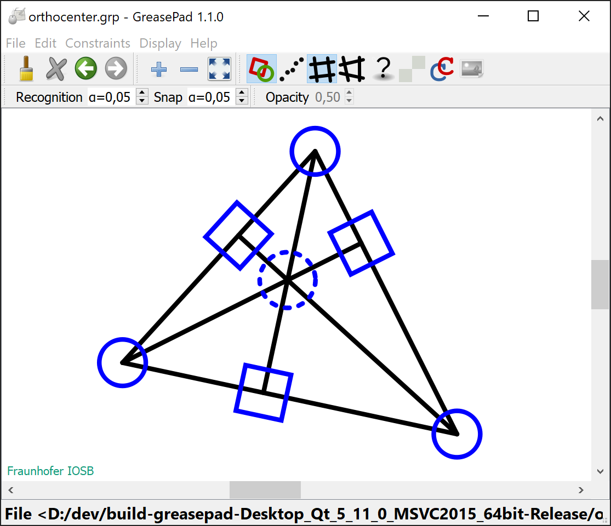
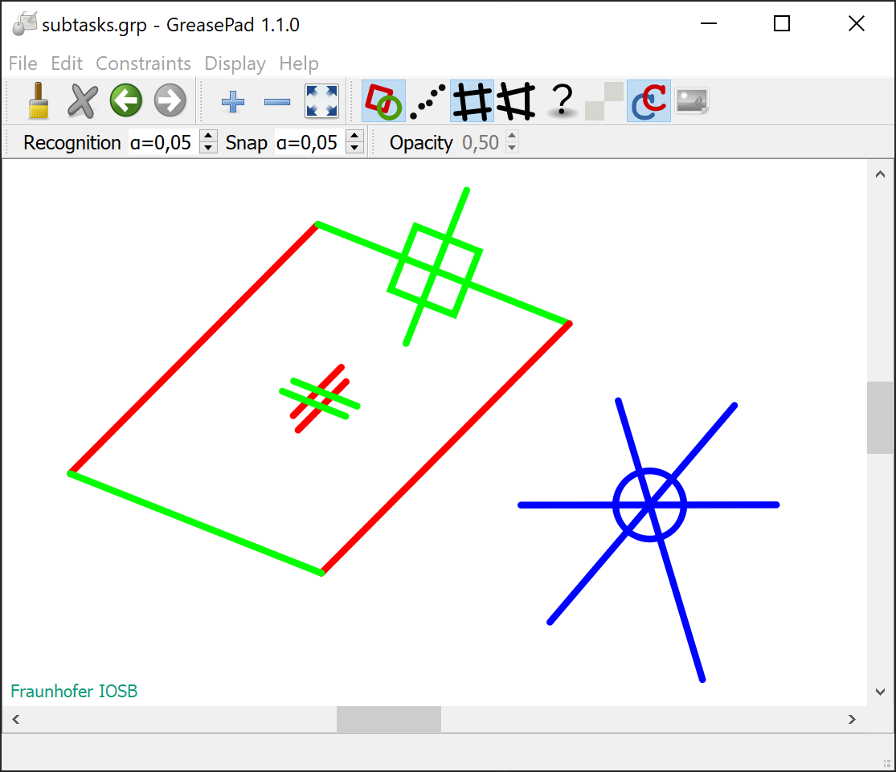
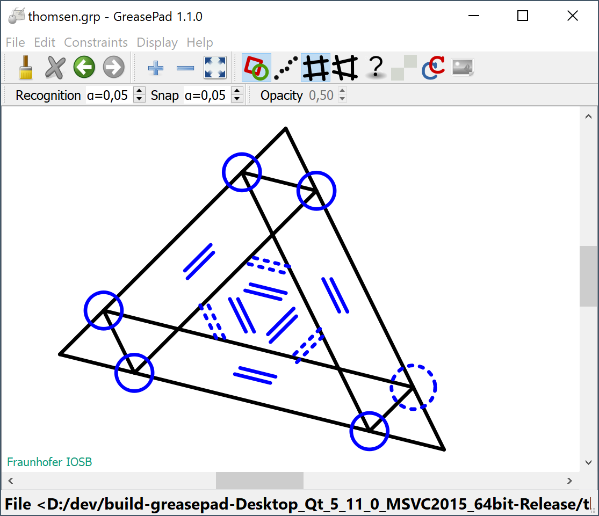
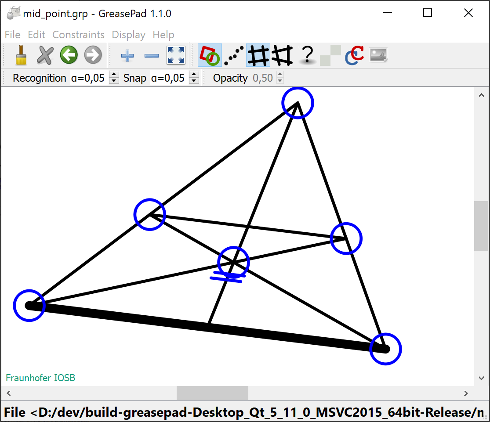

# GreasePad 1.2.0

The *GreasePad* provides a drawing area and expects pen strokes as the only user input. These strokes are approximated by straight line segments leading to line drawings. During this interactive process, geometric relations such as orthogonality are recognized and enforced immediately by an adjustment process. The program can be utilized to study systems of straight lines and constraints (closure theorems) or to outline the shapes of human-made objects in images. As a pointing device, you can use a computer mouse, a stylus, or one of your fingers in combination with a touchscreen.

<figure>

</figure>

## Content
- [News] (#news)
- [Precompiled Win64 binaries](#pre-compiled)
- [Gallery (Screenshots)](#gallery)
- [Copyright](#copyright)
- [Licensing](#licensing)
- [Contact](#contact)
- [References](#references)
- [Acknowledgements](#acknowledgements)
- [Frequently Asked Questions](#faq)

## News
* Version 1.2.0 (Oct. 2023): The additional, specific constraints *horizontal*, *vertical*, and *diagonal* enable the alignment of segments with the frame of the canvas. These constraints are disable be default, i.e., they have to be activated by selecting the corresponding menu item.

## Pre-compiled Win64 binaries

No installation procedure is provided. Instead, please perform the following steps:
                                                              
1. Download the zip file from [https://FraunhoferIOSB.github.io/GreasePad/downloads/GreasePad120_x64.zip](https://FraunhoferIOSB.github.io/GreasePad/downloads/GreasePad120_x64.zip) to your machine. 
2. Unpack the file contents to a folder. The zip file contains the executable *greasepad.exe* and the required dynamically linked libraries, and the redistributable *vcredist_x64.exe*.
3. select and start the executable *greasepad.exe*.

## Gallery (Screenshots)

<figure>

<figcaption align="left">
Pappus's hexagon theorem, affine form
</figcaption>
</figure>

<figure>

<figcaption align="left">
Confidence regions
</figcaption>
</figure>

<figure>

<figcaption align="left">
Tracing & outlining
</figcaption>
</figure>

<figure>

<figcaption align="left">
Orthocenter of a triangle
</figcaption>
</figure>

<figure>

<figcaption align="left">
Identification of subtasks (connected components)
</figcaption>
</figure>

<figure>

<figcaption align="left">
Thomsen's figure
</figcaption>
</figure>

<figure>

<figcaption align="left">
Mid point of a triangle's side
</figcaption>
</figure>

## Copyright

Copyright (c) 2022-2023 Jochen Meidow, [Fraunhofer IOSB](http::/www.iosb.fraunhofer.de), Germany.

## Licensing

This program is free software: you can redistribute it and/or modify it under the terms of the GNU General Public License as published by the Free Software Foundation, either [version 3 of the License](https://www.gnu.org/licenses/gpl-3.0.en.html), or (at your option) any later version.

This program is distributed in the hope that it will be useful, but WITHOUT ANY WARRANTY; without even the implied warranty of MERCHANTABILITY or FITNESS FOR A PARTICULAR PURPOSE.  See the GNU General Public License for more details.

You should have received a copy of the GNU General Public License along with this program.  If not, see <https://www.gnu.org/licenses/>.

## Contact

Jochen Meidow, Fraunhofer IOSB, Ettlingen, Germany.

<jochen.meidow@iosb.fraunhofer.de>

## References
Details on the utilized methods can be found in the following papers:

- J. Meidow (2023) [Geometric Reasoning for the freehand-drawn Delineation of 2D Geometries](https://doi.org/10.1016/j.isprsjprs.2023.05.001). ISPRS Journal of Photogrammetry and Remote Sensing, vol. 201, pp. 67-77
- J. Meidow and L. Lucks (2019) [Draw and Order - Modeless Interactive Acquisition of Outlines](https://doi.org/10.5194/isprs-annals-IV-2-W7-103-2019). ISPRS - Annals of Photogrammetry, Remote Sensing and Spatial Information Sciences, vol. IV-2/W7, pp. 103-110
- J. Meidow, H. Hammer, and L. Lucks (2020) [Delineation and Construction of 2D Geometries by Freehand Drawing and Geometric Reasoning](https://www.isprs-ann-photogramm-remote-sens-spatial-inf-sci.net/V-5-2020/77/2020/). ISPRS - Annals of the Photogrammetry, Remote Sensing and Spatial Information Sciences, vol. V-5-2020, pp. 77-84

## Acknowledgements
The author would like to thank Wolfgang Förstner (University of Bonn) and Horst Hammer (Fraunhofer IOSB) for their inspiring collaboration.

## Frequently Asked Questions

### Interaction

*Q. Given a scene with segments and constraints, how do I select individual segments and/or constraints?*

A. With a computer mouse as pointing device, you can select segments or constraints using the mouse's right button. With a stylus or one of your fingers, you will probably have to press for a short moment onto the touch pad. If a graphical element covers another element, you can change the visual stacking.
 
